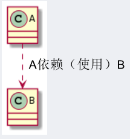
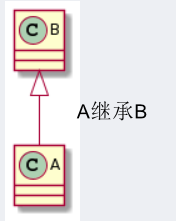
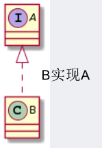
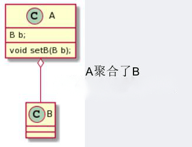
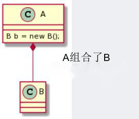

## 类的关系与符号表示
#### 依赖（使用）：虚线+箭头

#### 泛化（继承）：空心三角+实线

#### 实现：空心三角+虚线

#### 关联：实线、实线+单向箭头、实线+双向箭头
#### 聚合：空心菱形+实线
聚合关系是一种强关联关系，是整体和部分之间的关系，是 has-a 的关系，**整体和部分可以分开**。如：学校有老师。  

#### 组合：实心菱形+实线
组合关系是一种更强烈的聚合关系，是 contains-a 关系，**整体和部分不可以分开**。如：头包含鼻子。  

## IDEA画UML类图插件
1. PlantUML integration：有一个开源工具PlantUML，正规强大，参考 [文档](https://plantuml.com/zh/class-diagram) 画类图。
2. Joy UML designer：个人工具，功能够用，图形化容易操作；有BUG。

选PlantUML integration。

## PlantUML类图手册
1. 依赖：A ..> B
2. 泛化：B <|-- A
3. 实现：A <|.. B
4. 关联：A -- B
5. 聚合：A o-- B 小写字母o
6. 组合：A *-- B
