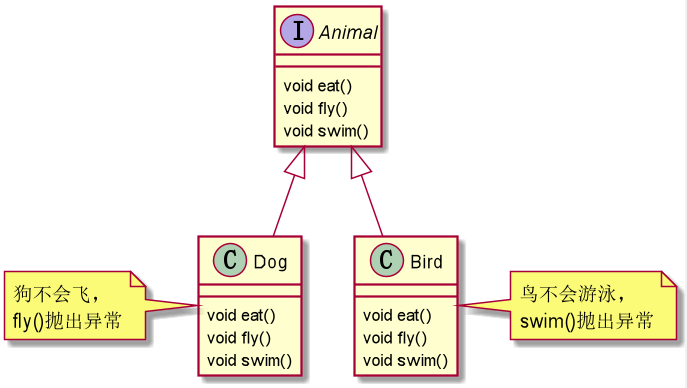
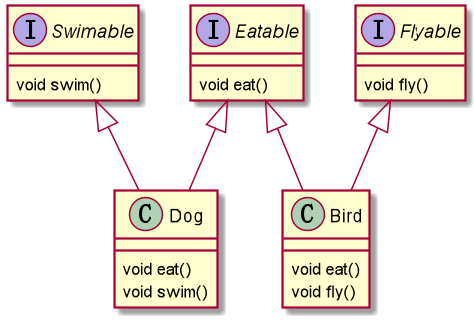
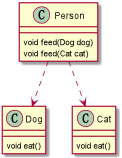
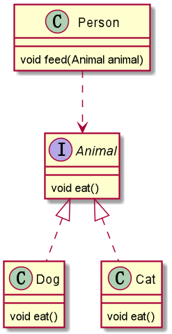
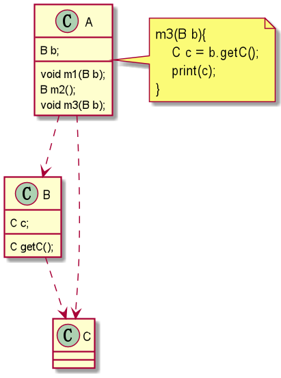
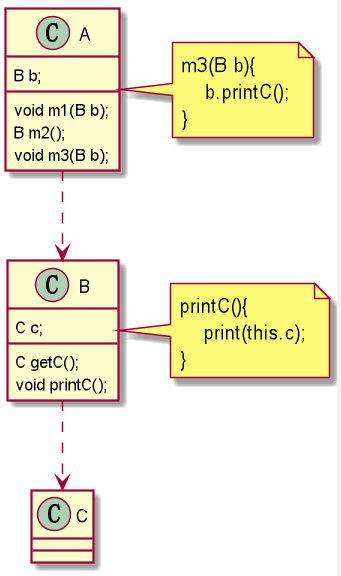

# 1. 设计原则的核心思想
一个字：分。

# 2. 七大设计原则

### 2.1 单一职责原则
#### 2.1.1 定义
每个方法、每个类、每个框架只负责一项职责。  
#### 2.1.2 好处
1. 降低复杂度。
2. 提高可读性、可维护性。
3. 降低变更引起的风险。

### 2.2 接口隔离原则
#### 2.2.1 定义
客户端不应该依赖它不需要的接口，即一个类对另一个类的依赖应该建立在最小接口上。
#### 2.2.2 示例代码
###### 不满足接口隔离原则  
  
###### 满足接口隔离原则  


### 2.3 开闭原则（Open Closed Principle,OCP）
#### 2.3.1 定义
1. 开闭原则是最基础、最重要的设计原则。
2. 软件中的实体（类，模块，函数等等）对扩展是开放的（对提供方），但对修改是封闭的（对使用方）。
3. 当软件有需求变化时，是通过扩展软件实体的行为来实现变化，而不是通过修改已有的代码来实现变化。
4. 编程中遵循其他原则，以及使用设计模式的目的，就是为了遵循开闭原则。
#### 2.3.2 示例代码
原本有一个汽车类，现在需求是要给汽车的价格打8折。
```java
public class Car{
    private BigDecimal price;
    public BigDecimal getPrice(){
        return price;
    }
}
```
###### 不满足开闭原则
直接修改源代码。
```java
public class Car{
    private BigDecimal price;
    public BigDecimal getPrice(){
        return price * 0.8;
    }
}
```
###### 满足开闭原则
扩展一个子类实现需求。
```java
public class DiscountCar extends Car{
    @Override
    public BigDecimal getPrice(){
        return price * 0.8;
    }
}
```

### 2.4 依赖倒转（置）原则
#### 2.4.1 定义
1. 高层模块不应该依赖低层模块，二者都应该依赖其抽象。
2. 抽象不应该依赖细节，细节应该依赖抽象。
3. 依赖倒转的中心思想是面向接口编程。
#### 2.4.2 传递依赖关系的三种方式
###### 接口传递
```java
interface I1{
    void m1();
}

class A{
    void m1(I1 i){
        i.m1();
    }
}
```
###### 构造方法传递
```java
interface I1{
    void m1();
}

class A{
    private I1 i;
    A(I1 i1) {
        this.i = i1;
    }
    void m1(){
        i.m1();
    }
}
```
###### setter方法传递
```java
interface I1{
    void m1();
}

class A{
    private I1 i;
    void setI(I1 i1) {
        this.i = i1;
    }
    void m1(){
        i.m1();
    }
}
```
#### 2.4.3 示例代码
###### 不满足依赖倒转原则
 
###### 满足依赖倒转原则
 

### 2.5 里氏替换原则（Liskov Substitution Principle,LSP）
#### 2.5.1 继承的思考
1. 继承包含这样一层含义：父类中凡是已经实现好的方法，实际上是在设定规范和契约，虽然它不强制要求所有子类必须遵循这些契约，但是子类对这些已经实现的方法进行任何修改，就会对继承体系造成破坏。
2. 继承带来便利也带来了弊端。如：使用继承给程序带来侵入性，程序可移植性降低，增加对象间的耦合性。修改一个父类，必须考虑所有子类，修改父类可能会导致子类功能产生故障。
#### 2.5.2 定义
子类可以替换父类：任何基类可以出现的地方，子类一定可以出现。
#### 2.5.3 好处
里氏替换原则是继承复用的基石，只有当衍生类可以替换基类，软件单位的功能不受到影响时，即基类随便怎么改动子类都不受此影响，那么基类才能真正被复用。
#### 2.5.4 注意
1. 子类尽量不要重写父类已实现的方法；在适当情况下，可以通过**聚合**、**组合**、**依赖**来解决问题。
2. 能否使用继承依据：是否有"is a"关系？子类替换父类后，业务逻辑是否变化？如果业务逻辑发生变化则不能使用继承（经典问题：正方形非长方形）。

### 2.6 迪米特法则（Law of Demeter,LOD）
#### 2.6.1 定义
1. 又叫最少知道原则；即一个类对自己依赖的类知道的越少越好。
2. 更简单的定义：只与朋友通信。朋友：出现在成员变量的类，方法参数的类，方法返回值中的类，自己new出来的类；非朋友：出现在局部变量的类。
#### 2.6.2 示例代码
###### 不满足迪米特法则

###### 满足迪米特法则

#### 2.6.3 注意
1. 迪米特法则的核心是降低类之间的耦合；只是要求降低类间耦合，并不是要求完全没有依赖关系（这是不可能的）。
2. 缺点：要完全符合迪米特法则，会在系统里造出大量的小方法，这些方法仅仅是传递间接的调用，与系统的业务逻辑无关。
3. 结论：可以适当违反。

### 2.7 组合优于继承
#### 2.7.1 定义
在软件复用时，要尽量先使用**组合**或者**聚合**等关联关系来实现，其次才考虑使用继承关系来实现。
#### 2.7.2 反例
JDK中的Stack，继承了Vector，仅仅为了复用一些方法，搞得Stack拥有不属于栈特性的方法；只能说Stack像一个栈，而不是一个纯粹的栈。
#### 2.7.3 注意
1. 如果父类作者与子类作者不是同一个人，就别用继承；因为父类不知道未来子类会重写自己的哪个方法；子类也不知道未来父类会新增哪个方法。
2. 如果父类作者与子类作者是同一个人，就放心使用继承；因为作者同时控制父类和子类。
3. 如果仅仅为了复用代码而继承别人的类，难免会出现“沟通”上的问题。