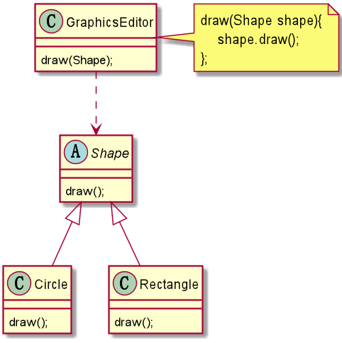
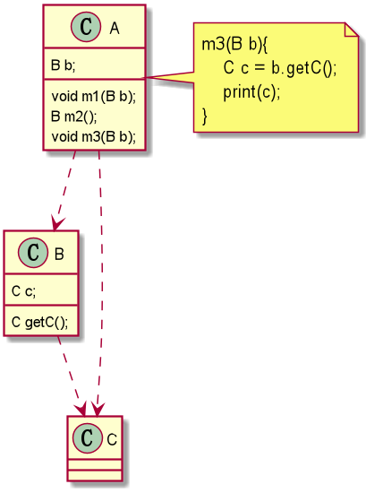

# 设计原则的核心思想
1. 把不需要变化的代码从应用中独立出来。
2. 针对接口编程，而不是针对实现编程。
3. 为了交互对象之间的松耦合设计而努力。

# 七大设计原则

### 单一职责原则（Single Responsibility Principle,SRP）
#### 定义
一个类只负责一项职责。  
#### 好处
1. 降低类的复杂度。
2. 提高类的可读性、可维护性。
3. 降低变更引起的风险。
#### 注意细节
1. 通常情况下，**应当遵守单一职责原则**，只有逻辑足够简单，才可以在代码级别违反单一职责原则；只有类中方法数量足够少，可以在方法级别保持单一职责原则。
#### 示例代码
###### 不满足单一职责原则
```java
// 交通工具
class Vehicle {
    public void run(String vehicle) {
        System.out.println(vehicle + "在公路上运行...");
    }
}

public class SingleResponsibility {
    public static void main(String[] args) {
        Vehicle vehicle = new Vehicle();
        vehicle.run("汽车");
        vehicle.run("摩托车");
        vehicle.run("飞机"); // 飞机不在公路上运行
    }
}
```
###### 类级别满足单一职责原则
```java
class RoadVehicle {
    public void run(String vehicle) {
        System.out.println(vehicle + "在公路上运行...");
    }
}

class AirVehicle{
    public void run(String vehicle) {
        System.out.println(vehicle + "在天空上运行...");
    }
}

public class SingleResponsibility {
    public static void main(String[] args) {
        RoadVehicle roadVehicle = new RoadVehicle();
        roadVehicle.run("汽车");
        roadVehicle.run("摩托车");
        AirVehicle airVehicle = new AirVehicle();
        airVehicle.run("飞机");
    }
}
```
###### 方法级别满足单一职责原则
```java
class Vehicle {
    public void run(String vehicle) {
        System.out.println(vehicle + "在公路上运行...");
    }
    public void runAir(String vehicle) {
        System.out.println(vehicle + "在天空上运行...");
    }
}

public class SingleResponsibility {
    public static void main(String[] args) {
        Vehicle3 vehicle = new Vehicle3();
        vehicle.run("汽车");
        vehicle.run("摩托车");
        vehicle.runAir("飞机");
    }
}
```

### 接口隔离原则（Interface Segregation Principle,ISP）
#### 定义
客户端不应该依赖它不需要的接口，即一个类对另一个类的依赖应该建立在最小接口上。
#### 示例代码
###### 不满足接口隔离原则  
  
```java
interface interface1 {
    void method1();
    void method2();
    void method3();
    void method4();
    void method5();
}

class B implements interface1 {
    @Override
    public void method1() {}
    @Override
    public void method2() {}
    @Override
    public void method3() {}
    @Override
    public void method4() {}
    @Override
    public void method5() {}
}

class D implements interface1 {
    @Override
    public void method1() {}
    @Override
    public void method2() {}
    @Override
    public void method3() {}
    @Override
    public void method4() {}
    @Override
    public void method5() {}
}

class A {
    public void depend1(interface1 i) {
        i.method1();
    }
    public void depend2(interface1 i) {
        i.method2();
    }
    public void depend3(interface1 i) {
        i.method3();
    }
}

class C {
    public void depend1(interface1 i) {
        i.method1();
    }
    public void depend4(interface1 i) {
        i.method4();
    }
    public void depend5(interface1 i) {
        i.method5();
    }
}
```
###### 满足接口隔离原则  

```java
interface interface2 {
    void method1();
}

interface interface3 {
    void method2();
    void method3();
}

interface interface4 {
    void method4();
    void method5();
}

class B2 implements interface2,interface3 {
    @Override
    public void method1() {}
    @Override
    public void method2() {}
    @Override
    public void method3() {}
}

class D2 implements interface2,interface4 {
    @Override
    public void method1() {}
    @Override
    public void method4() {}
    @Override
    public void method5() {}
}

class A2 {
    public void depend1(interface2 i) {
        i.method1();
    }
    public void depend2(interface3 i) {
        i.method2();
    }
    public void depend3(interface3 i) {
        i.method3();
    }
}

class C2 {
    public void depend1(interface2 i) {
        i.method1();
    }
    public void depend4(interface4 i) {
        i.method4();
    }
    public void depend5(interface4 i) {
        i.method5();
    }
}
```

### 依赖倒转原则（Dependence Inversion Principle）
#### 定义
1. 高层模块不应该依赖低层模块，二者都应该依赖其抽象。
2. 抽象不应该依赖细节，细节应该依赖抽象。
3. 依赖倒转的中心思想是面向接口编程。
#### 好处
1. 相对于细节的多变性，抽象的东西要稳定的多；以抽象为基础搭建的架构比以细节为基础搭建的架构要稳定的多。
2. 使用接口或抽象类的目的是制定好规范，而不涉及任何具体的操作，把展现细节的任务交给它们的实现类去完成。
#### 注意细节
1. 低层模块尽量都要有抽象类或接口。
2. 变量的声明类型尽量是抽象类或接口。
3. 继承时遵循里氏替换原则。
#### 传递依赖关系的三种方式
###### 接口传递
```java
interface I1{
    void m1();
}

class A{
    void m1(I1 i){
        i.m1();
    }
}
```
###### 构造方法传递
```java
interface I1{
    void m1();
}

class A{
    private I1 i;
    A(I1 i1) {
        this.i = i1;
    }
    void m1(){
        i.m1();
    }
}
```
###### setter方法传递
```java
interface I1{
    void m1();
}

class A{
    private I1 i;
    void setI(I1 i1) {
        this.i = i1;
    }
    void m1(){
        i.m1();
    }
}
```
#### 示例代码
###### 不满足依赖倒转原则
```java
class Email{
    String getInfo(){
        return "信息";
    }
}

class Person{
    void receive(Email email){
        email.getInfo();
    }
}

public class DependenceInversion{
    public static void main(String[] args){
        Persion persion = new Persion();
        persion.receive(new Email());
    }
}
```
###### 满足依赖倒转原则
```java
interface IReceiver{
    String getInfo();
}

class Email implements IReceiver{
    String getInfo(){
        return "邮件信息";
    }
}

class WeiXin implements IReceiver{
    String getInfo(){
        return "微信信息";
    }
}

class Person{
    void receive(IReceiver receiver){
        receiver.getInfo();
    }
}

public class DependenceInversion{
    public static void main(String[] args){
        Persion persion = new Persion();
        persion.receive(new Email());
        persion.receive(new WeiXin());
    }
}
```

### 里氏替换原则（Liskov Substitution Principle,LSP）
#### 继承的思考
1. 继承包含这样一层含义：父类中凡是已经实现好的方法，实际上是在设定规范和契约，虽然它不强制要求所有子类必须遵循这些契约，但是子类对这些已经实现的方法进行任何修改，就会对继承体系造成破坏。
2. 继承带来便利也带来了弊端。如：使用继承给程序带来侵入性，程序可移植性降低，增加对象间的耦合性。修改一个父类，必须考虑所有子类，修改父类可能会导致子类功能产生故障。
#### 定义
子类可以替换父类：任何基类可以出现的地方，子类一定可以出现。
#### 好处
里氏替换原则是继承复用的基石，只有当衍生类可以替换基类，软件单位的功能不受到影响时，即基类随便怎么改动子类都不受此影响，那么基类才能真正被复用。
#### 注意细节
1. 子类尽量不要重写父类已实现的方法。
2. 继承让两个类的耦合性增强了，在适当情况下，可以通过**聚合**、**组合**、**依赖**来解决问题。

### 开闭原则（Open Closed Principle,OCP）
#### 定义
1. 开闭原则是最基础、最重要的设计原则。
2. 软件中的实体（类，模块，函数等等）应该对于扩展是开放的（对提供方），但是对于修改是封闭的（对使用方）。用抽象构建框架，用实现扩展细节。
3. 当软件有需求变化时，是通过扩展软件实体的行为来实现变化，而不是通过修改已有的代码来实现变化。
4. 编程中遵循其他原则，以及使用设计模式的目的，就是为了遵循开闭原则。
#### 示例代码
###### 不满足依赖开闭原则

###### 满足依赖开闭原则


### 迪米特法则（Law of Demeter,LOD）
#### 定义
1. 又叫最少知道原则；即一个类对自己依赖的类知道的越少越好。
2. 更简单的定义：只与直接朋友通信。直接朋友：出现在成员变量，方法参数，方法返回值中的类；非直接朋友：出现在局部变量的类。
#### 示例代码
###### 不满足迪米特法则

###### 满足迪米特法则

#### 注意细节
1. 迪米特法则的核心是降低类之间的耦合；只是要求降低类间耦合，并不是要求完全没有依赖关系（这是不可能的）。

### 合成复用原则（Composite Reuse Principle，CRP）
#### 定义
1. 在软件复用时，要尽量先使用**组合**或者**聚合**等关联关系来实现，其次才考虑使用继承关系来实现。
