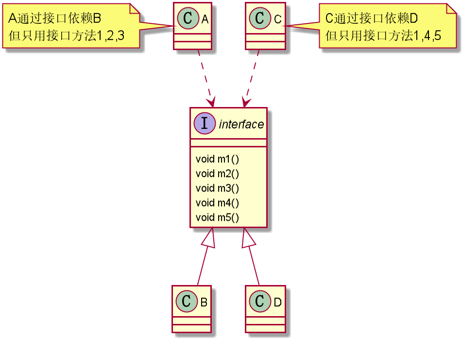
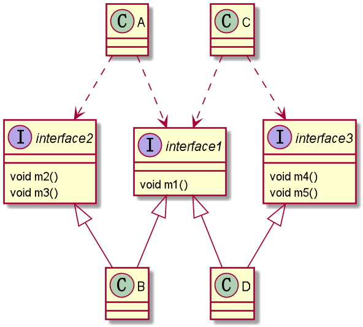

# 设计模式的目的
**为了让程序具有更好的**
1. 代码重用性
2. 可读性
3. 可扩展性
4. 可靠性
5. 高内聚、低耦合


# 七大设计原则

### 单一职责原则（Single Responsibility Principle）
#### 定义
一个类只负责一项职责。  
#### 好处
1. 降低类的复杂度。
2. 提高类的可读性、可维护性。
3. 降低变更引起的风险。
#### 注意细节
1. 通常情况下，**应当遵守单一职责原则**，只有逻辑足够简单，才可以在代码级别违反单一职责原则；只有类中方法数量足够少，可以在方法级别保持单一职责原则。
#### 示例代码
###### 不满足单一职责原则
```java
// 交通工具
class Vehicle {
    public void run(String vehicle) {
        System.out.println(vehicle + "在公路上运行...");
    }
}

public class SingleResponsibility {
    public static void main(String[] args) {
        Vehicle vehicle = new Vehicle();
        vehicle.run("汽车");
        vehicle.run("摩托车");
        vehicle.run("飞机"); // 飞机不在公路上运行
    }
}
```
###### 类级别满足单一职责原则
```java
class RoadVehicle {
    public void run(String vehicle) {
        System.out.println(vehicle + "在公路上运行...");
    }
}

class AirVehicle{
    public void run(String vehicle) {
        System.out.println(vehicle + "在天空上运行...");
    }
}

public class SingleResponsibility {
    public static void main(String[] args) {
        RoadVehicle roadVehicle = new RoadVehicle();
        roadVehicle.run("汽车");
        roadVehicle.run("摩托车");
        AirVehicle airVehicle = new AirVehicle();
        airVehicle.run("飞机");
    }
}
```
###### 方法级别满足单一职责原则
```java
class Vehicle {
    public void run(String vehicle) {
        System.out.println(vehicle + "在公路上运行...");
    }
    public void runAir(String vehicle) {
        System.out.println(vehicle + "在天空上运行...");
    }
}

public class SingleResponsibility {
    public static void main(String[] args) {
        Vehicle3 vehicle = new Vehicle3();
        vehicle.run("汽车");
        vehicle.run("摩托车");
        vehicle.runAir("飞机");
    }
}
```

### 接口隔离原则（Interface Segregation Principle）
1. 客户端不应该依赖它不需要的接口，即一个类对另一个类的依赖应该建立在最小接口上。

不满足隔离原则的设计：  
  
通过隔离原则处理后：  


### 依赖倒转原则

### 里氏替换原则

### 开闭原则

### 迪米特法则

### 合成复用原则

# 二十三种设计模式