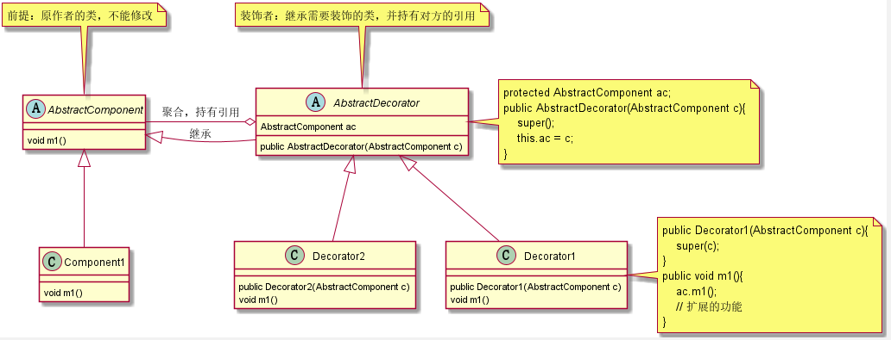
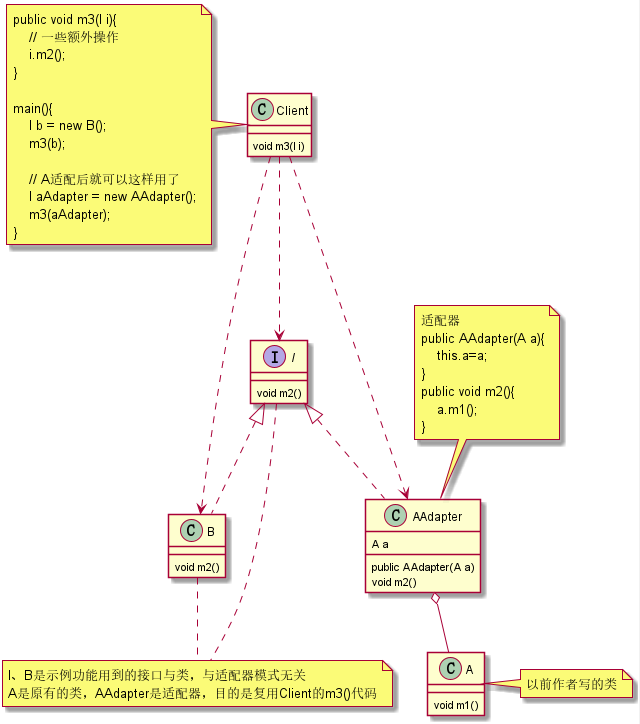

# 1. 设计模式的目的
1. 提升软件的维护性、通用性和扩展性，降低软件的复杂度。核心是七大设计原则。
2. 设计模式有优点也有缺点，每种设计模式都有其适用的场景，不要为了使用设计模式而使用设计模式，切记防止“模式的滥用”。

# 2. 设计模式分类
目前公认的是23种（即：GoF设计模式）。  

|模式分类|对象模式|
|----|:----|
|创建型模式|单例模式、工厂模式、抽象工厂模式、原型模式、建造者模式|
|结构型模式|适配器模式、装饰器模式、代理模式、外观模式、桥接模式、组合模式、享元模式|
|行为型模式|策略模式、模板方法模式、观察者模式、迭代子模式、责任链模式、命令模式、备忘录模式、状态模式、访问者模式、中介者模式、解释器模式|

# 3. 二十三种设计模式

### 3.1 单例模式
##### 定义
系统中只有一个类的唯一实例。
##### java中创建类的方式【补充】
1. new关键字：单例模式解决这点。
2. 反射：会破坏单例模式。
3. 反序列化：会破坏单例模式，添加readResolve()方法解决。
4. 克隆：会破坏单例模式。
#### 3.1.1 饿汉式（静态常量）
##### 示例代码
```java
class A{
    // 1.构造方法私有化
    private A(){}
    // 2.本类内部创建对象实例
    private static final A instance = new A();
    // 3.对外提供公有静态方法，返回实例
    public static A getInstance(){
        return instance;
    }
}
```
##### 总结
1. 优点：写法简单，在类加载时完成实例化，避免了线程同步问题。
2. 缺点：在类加载时就完成实例化，没有达到懒加载效果；如果从始至终不使用这个对象，会造成内存浪费。
3. 结论：这种单例模式**可用**，可能会造成内存浪费。
#### 3.1.2 饿汉式（静态代码块）
##### 示例代码
```java
class A{
    private A(){}
    private static A instance;
    static {
        instance = new A();
    }
    public static A getInstance(){
        return instance;
    }
}
```
##### 总结
1. 优缺点：与饿汉式（静态常量）一致。
2. 结论：这种单例模式**可用**，可能会造成内存浪费。
#### 3.1.3 懒汉式（线程不安全）
##### 示例代码
```java
class A{
    private A(){}
    private static A instance;
    public static A getInstance(){
        if (instance == null) {
            instance = new A();
        }
        return instance;
    }
}
```
##### 总结
1. 优点：起到懒加载效果；但只能在单线程环境下使用。
2. 缺点：线程不安全。在多线程环境下，一个线程进入`if (instance == null)`判断语句，还未来得及往下执行，另一个线程也通过了这个判断，就会产生多个实例。
3. 结论：这种单例模式**不可用**。
#### 3.1.4 懒汉式（线程安全）
##### 示例代码
```java
class A{
    private A(){}
    private static A instance;
    public static synchronized A getInstance(){
        if (instance == null) {
            instance = new A();
        }
        return instance;
    }
}
```
##### 总结
1. 优点：懒加载，线程安全。
2. 缺点：效率低。每个线程想要获取类的实例时，都需要同步。
3. 结论：这种单例模式**不推荐使用**。
#### 3.1.5 懒汉式（双重检查，Double-Check）
##### 示例代码
```java
class A{
    private A(){}
    // volatile 保证内存可见性
    private static volatile A instance;
    public static A getInstance(){
        if (instance == null) {
            synchronized (A.class) {
                if (instance == null) {
                    instance = new A();
                }
            }
        }
        return instance;
    }
}
```
##### 总结
1. 优点：线程安全，懒加载，效率较高。
2. 结论：这种单例模式**推荐使用**。
#### 3.1.6 懒汉式（静态内部类）
##### 示例代码
```java
class A{
    private A(){}
    private static class B {
        private static final A INSTANCE = new A();
    }
    public static A getInstance(){
        return B.INSTANCE;
    }
}
```
##### 总结
1. 静态内部类特点（懒加载）：静态内部类B在A类被装载时不会立即初始化；当`getInstance()`被调用时才会装载B，才会实例化。
2. 优点：线程安全（JVM类加载机制保证），懒加载，效率较高。
3. 结论：这种单例模式**推荐使用**，但是不理解静态内部类特点看不懂代码。
#### 3.1.7 枚举
##### 示例代码
```java
public class Main {
    public static void main(String[] args){
        A a = A.INSTANCE;
        a.method1();
    }
}

enum A{
    INSTANCE;
    public void method1(){}
}
```
##### 总结
1. 优点：借助JDK1.5的枚举来实现单例模式，不仅避免多线程同步问题，而且还能防止反序列化重新创建对象。
2. 这种方式是《Effective Java》作者提倡的方式。
3. 结论：**推荐使用**。

### 3.2 工厂模式
##### 定义
定义一个创建产品对象的工厂接口，将产品对象的实际创建工作推迟到具体子工厂类当中。  
##### 概念
+ 产品：类。
+ 抽象产品：抽象类、接口。
+ 产品簇：是指由同一个工厂生产的，位于不同产品等级结构中的一组产品。
+ 产品等级：产品等级结构即产品的继承结构。

#### 3.2.1 简单工厂模式（不属于23种设计模式之一）
简单工厂模式是工厂模式的一种，也叫“静态工厂模式”。
##### UML类图

##### 总结
1. 优点：简单易懂。
2. 缺点：工厂类单一，代码臃肿，违背高聚合原则。
3. 缺点：新增一个产品，就要增加一个具体产品类，修改工厂逻辑；增加系统的复杂度，违背“开闭原则”。
4. 结论：对于产品种类相对较少且趋于不变的情况，可以考虑使用。
#### 3.2.2 工厂方法模式
##### UML类图

##### 总结
1. 优点：创建新产品只需多写一个相应的产品类、工厂类，无需修改之前的代码；完美符合“开闭原则”。
2. 缺点：产品增多时，类会爆炸式增长；一个抽象工厂只能生产一种产品（抽象工厂模式解决）。
3. 结论：只有一个产品等级且产品种类在一定数量内时，可以考虑使用。
#### 3.2.3 抽象工厂模式
##### UML类图

##### 总结
1. 优点：把工厂类的数量减少了。无论多少个产品等级，抽象工厂类就一个，工厂类就一套！
2. 抽象工厂中，生产的多个产品之间必须有内在联系，即产品簇。
3. 缺点：产品等级发生变化（增删），需要修改以前的所有工厂代码，违反了“开闭原则”。
4. 结论：当产品等级比较固定时，可以考虑使用抽象工厂模式；如果产品等级经常变化，则不建议使用抽象工厂模式。

### 3.3 原型模式
##### 定义
用原型实例指定创建对象的种类，并且通过拷贝这些原型创建新的对象。
#### 3.3.1 浅拷贝
##### 示例代码
1. 实现Cloneable接口。
2. 重写Object的clone方法，修改访问权限修饰符为public。
```java
public class ShallowClone implements Cloneable{
    private String name;
    private Date birthday; // 引用对象

    @Override
    public Object clone() throws CloneNotSupportedException {
        return super.clone();
    }
}
```
##### 总结
1. 优点：简单，能实现基本的拷贝。
2. 缺点：拷贝对象与原对象中的引用对象指向同一个内存地址，任何一个副本修改引用对象中的属性都会影响其他副本。
3. 结论：**不推荐使用**。
#### 3.3.2 深拷贝（重写clone方法）
##### 示例代码
浅拷贝的基础上，在clone方法中处理引用对象的拷贝。
```java
public class DeepClone implements Cloneable{
    private String name;
    private Date birthday;
    public void setBirthday(Date birthday) {this.birthday = birthday;}
    public Date getBirthday() {return birthday;}
    @Override
    public Object clone() throws CloneNotSupportedException {
        DeepClone cloneObj = (DeepClone)super.clone();
        Date copyDate = (Date)cloneObj.getBirthday().clone();
        cloneObj.setBirthday(copyDate);
        return cloneObj;
    }
}
```
##### 总结
1. 优点：解决了浅拷贝的问题。
2. 缺点：当引用对象有很多层时（即引用对象里面还有引用对象），重写clone方法的工作量非常大！
3. 结论：**不推荐使用**。
#### 3.3.3 深拷贝（序列化）
##### 示例代码
1. 实现Cloneable接口，Serializable接口。
2. 重写Object的clone方法为：把当前对象写入到内存，然后从内存反序列化对象；修改访问权限修饰符为public。
```java
public class DeepClone implements Cloneable, Serializable {
    @Override
    public Object clone() {
        try {
            // 对象写到内存
            ByteArrayOutputStream bos = new ByteArrayOutputStream();
            ObjectOutputStream oos = new ObjectOutputStream(bos);
            oos.writeObject(this);
            oos.close();

            // 从内存中取数据
            byte[] bytes = bos.toByteArray();

            ByteArrayInputStream bis = new ByteArrayInputStream(bytes);
            ObjectInputStream ois = new ObjectInputStream(bis);
            Object cloneObj = ois.readObject();
            ois.close();
            return cloneObj;
        } catch (Exception e) {
            throw new RuntimeException(e);
        }
    }
}
```
##### 总结
1. 优点：完美的“原型模式”的实现。
2. 结论：**推荐使用**。

### 3.4 建造者模式
##### 定义
将一个复杂对象的构建与它的表示分离，使得同样的构建过程可以创建不同的表示。
##### UML类图

##### 总结
1. 建造者接口用于稳定建造过程，指挥者用于把指挥过程从客户端分离。
2. 指挥者依赖建造者接口，满足“依赖倒置原则”。
3. 工厂模式关注新建产品的结果；建造者模式关注新建产品的过程。

### 3.5 装饰（者/器）模式
##### 定义
在不必改变原类文件和使用继承的情况下，动态地扩展一个对象的功能。
##### UML类图

##### 举例
JDK中，I/O流就是使用了装饰模式，抽象装饰类是FilterXXXXStream。
##### 总结
1. 优点：新增组件类，以及新增装饰器类，都不会违反“开闭原则”。
2. 缺点：过度使用会导致出现许多装饰器类，但已经是最优方案了。

### 3.6 模板方法模式
##### 定义
定义一个算法的步骤，允许子类为一个或多个步骤提供其实践方式。
##### UML类图

##### 总结
1. 缺点：由于继承，如果模板类添加新的抽象方法，则所有子类都要改一遍。

### 3.7 适配器模式
##### 定义
将一个类的接口适配成用户所期待的接口，让那些接口不兼容的类可以一起工作。  
通俗的解释：根据已有接口，生成想要的接口。
##### UML类图

##### 总结
1. 场景：原本有一个类，发现它与新写的类及其类似，想把它用到新写的功能接口上面去。（《Java编程思想》第四版第九章“完全解耦”）
2. 体现“开闭原则”、“组合优于继承”。