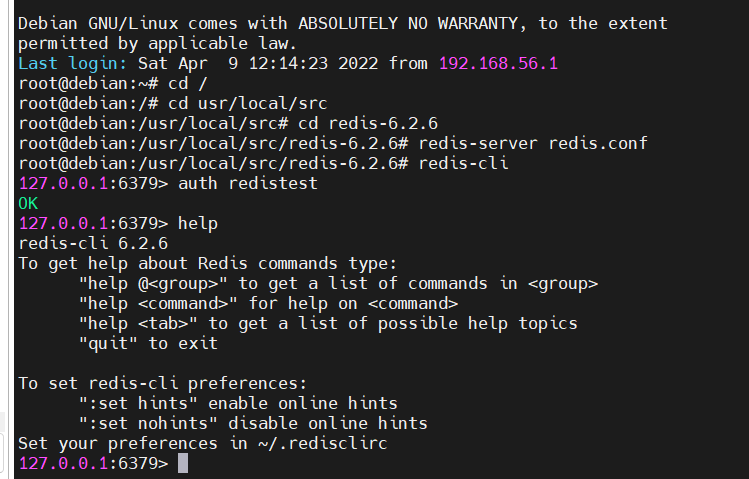

# 1. 介绍和安装

### 1.1 介绍
1. Redis（Remote Dictionary Server），即远程字典服务。
2. 基于内存是它快的最主要原因。
3. [官网](https://redis.io/) 查看手册。

### 1.2 安装
1. 先准备好linux系统（使用虚拟机）。
2. 源码安装 [参考](https://redis.io/docs/getting-started/installation/install-redis-from-source/) ，缺少依赖自行解决，默认安装在/usr/local/bin，完成后redis相关命令自动加到环境变量了。
3. 参考设置文件在源码解压目录下redis.conf，一些设置项目如下：
   + requirepass：设置访问redis的密码，建议必须设置。如：redistest。
   + bind：监听地址，改为 0.0.0.0 允许任意ip访问，生产环境不允许这样设置。
   + daemonize：守护进程，改为 yes 即可后台运行。
   + port：监听端口，选改。
   + dir：工作目录，默认当前目录，运行redis-server命令时，日志、持久化等文件会保存在这里。
   + databases：数据库数量，选设。
   + maxmemory：设置redis能够使用的最大内存，选设。
   + logfile：日志文件，默认为空表示不记录。选填，如：redis.log
4. 不设置开机自启，记录启动命令。
    ```shell
    cd /usr/local/src/redis-6.2.6
    redis-server redis.conf
    ```
5. 命令行客户端
    ```shell
    方式一
    redis-cli -h ip地址 -p 端口 -a 密码
    
    方式二
    redis -h ip地址 -p 端口
    auth 密码
    ```
6. 在客户端输入 help 查看帮助。
