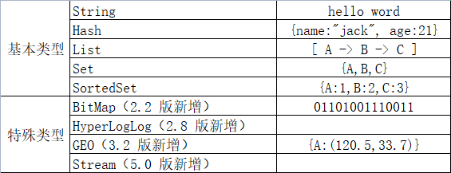
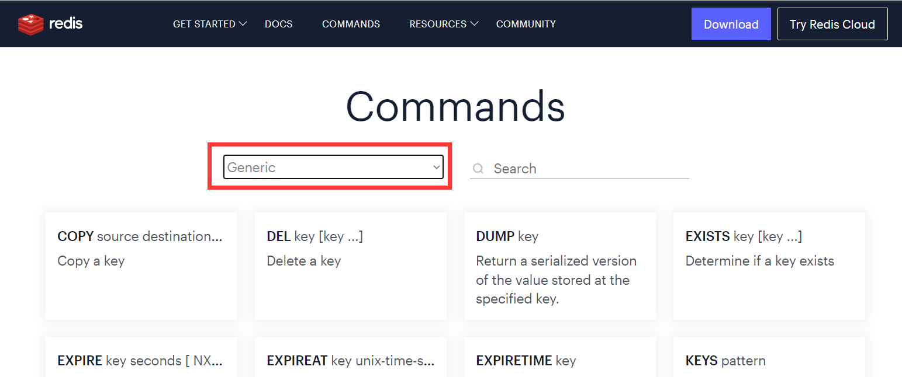

# 数据结构
key一般是string类型，value有许多类型。

### value类型

### key的层级格式
redis的key允许多个单词形成层级结构，多个单词之间用:隔开。在图形化工具上会显示应有的表现形式。

___

# 通用命令

### 常用通用命令
1. keys：查看符合模板的所有key，模糊查询效率低，不建议在生产环境使用。
2. del：删除key。
3. exists：判断key是否存在。
4. expire：给key设置有效期，到期redis会自动删除。
5. ttl(time to live)：查看一个key的剩余有效期。
___

# 常用数据类型和命令

## string类型
string（字符串）类型，是redis中最简单的存储类型。虽然value是字符串，但根据字符串格式不同，又可分3类：
+ string：普通字符串
+ int：整数类型，可以做自增、自减操作
+ float：浮点类型，可以做自增、自减操作

|key|value|
|----|----|
|name|jack|
|num|10|
|temp|85.5|

不管是那种数据类型，底层都是字节数组存储，只不过编码方式不同。数字会转换成二进制去存储，这样一个字节就可以表示很大的数字了，节省空间。字符串就只能转换成对应的字节码存储。

### string常用命令
+ set：新增或修改一个string类型的键值对
+ get：根据key获取string类型的value
+ mset：批量添加string类型的键值对
+ mget：批量获取
+ incr：整数自增1
+ incrby：整数指定步长自增
+ decr：整数自减
+ incrbyfloat：浮点数按照指定步长增长
+ setnx：添加一个string类型的键值对，前提是这个key不存在，否则不执行；等价组合命令 set ... nx
+ setex：添加一个string类型的键值对并设置有效期；等价组合命令 set ... ex ...

## hash类型
### hash常用命令

## list类型
### list常用命令

## set类型
### set常用命令