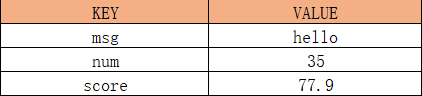
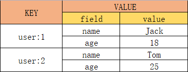

# 数据结构
key一般是string类型，value有许多类型。

### value类型

### key的层级格式
redis的key允许多个单词形成层级结构，多个单词之间用:隔开。在图形化工具上会显示应有的表现形式。

___

# 通用命令

### 常用通用命令
1. KEYS pattern：查看符合模板的所有key，模糊查询效率低，不建议在生产环境使用。如`keys *`
2. DEL key：删除key。如`del a1`
3. EXISTS key：判断key是否存在。如`exists b1`
4. EXPIRE key seconds：给key设置有效期，到期redis会自动删除。如`expire c1 10`
5. TTL(time to live) key：查看一个key的剩余有效期。返回-2表示到期，返回-1表示永久有效。如`ttl k1`

___

# 常用数据类型和命令

## string类型
string（字符串）类型，是redis中最简单的存储类型。虽然value是字符串，但根据字符串格式不同，又可分3类：
+ string：普通字符串
+ int：整数类型，可以做自增、自减操作
+ float：浮点类型，可以做自增、自减操作

不管是哪种数据类型，底层都是字节数组存储，只不过编码方式不同。数字会转换成二进制去存储，这样一个字节就可以表示很大的数字了，节省空间。字符串就只能转换成对应的字节码存储。

### string常用命令
+ SET key value：新增或修改一个string类型的键值对。如`set name Jack`
+ GET key：根据key获取string类型的value。如`get age`
+ MSET key value：批量添加string类型的键值对。如`mset k1 v1 k2 v2`
+ MGET key：批量获取。如`mget k1 k2`
+ INCR key：整数自增1。如`incr age`
+ INCRBY key increment：整数指定步长自增，步长为负数就是减。如`incrby num 3`
+ DECR key：整数自减。如`decr age`
+ INCRBYFLOAT key increment：浮点数按照指定步长增长。如`incrbyfloat num2 0.3`
+ SETNX(Not eXists) key value：添加一个string类型的键值对，前提是这个key不存在，否则不执行；等价组合命令 set ... nx。如`setnx k2 v2`
+ SETEX key seconds value：添加一个string类型的键值对并设置有效期；等价组合命令 set ... ex ...。如`setex name 15 aaa`

## hash类型
hash类型，也叫散列，value是一个无序字典。

### hash常用命令

## list类型
### list常用命令

## set类型
### set常用命令

## sortedset类型（zset）
### sortedset常用命令