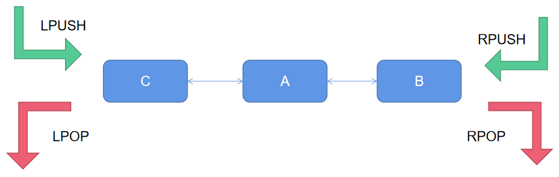

# 2. 数据结构和命令

## 2.1 数据结构

key一般是string类型，value有许多类型。

**value类型**

**key的层级格式**

redis的key允许多个单词形成层级结构，多个单词之间用:隔开。在图形化工具上会显示应有的表现形式。

___

## 2.2 通用命令

**常用通用命令**
1. KEYS pattern：查看符合模板的所有key，模糊查询效率低，不建议在生产环境使用。如`keys *`
2. DEL key：删除key。如`del a1`
3. EXISTS key：判断key是否存在。如`exists b1`
4. EXPIRE key seconds：给key设置有效期，到期redis会自动删除。如`expire c1 10`
5. TTL(time to live) key：查看一个key的剩余有效期。返回-2表示到期，返回-1表示永久有效。如`ttl k1`

___

## 2.3 常用数据类型和命令

### 2.3.1 string类型

string（字符串）类型，是redis中最简单的存储类型。虽然value是字符串，但根据字符串格式不同，又可分3类：
+ string：普通字符串
+ int：整数类型，可以做自增、自减操作
+ float：浮点类型，可以做自增、自减操作

不管是哪种数据类型，底层都是字节数组存储，只不过编码方式不同。数字会转换成二进制去存储，这样一个字节就可以表示很大的数字了，节省空间。字符串就只能转换成对应的字节码存储。

**string常用命令**
+ SET key value：新增或修改一个string类型的键值对。如`set name Jack`
+ GET key：根据key获取string类型的value。如`get age`
+ MSET key value：批量添加string类型的键值对。如`mset k1 v1 k2 v2`
+ MGET key：批量获取。如`mget k1 k2`
+ INCR key：整数自增1。如`incr age`
+ INCRBY key increment：整数指定步长自增，步长为负数就是减。如`incrby num 3`
+ DECR key：整数自减。如`decr age`
+ INCRBYFLOAT key increment：浮点数按照指定步长增长。如`incrbyfloat num2 0.3`
+ SETNX(Not eXists) key value：添加一个string类型的键值对，前提是这个key不存在，否则不执行；等价组合命令 set ... nx。如`setnx k2 v2`
+ SETEX key seconds value：添加一个string类型的键值对并设置有效期；等价组合命令 set ... ex ...。如`setex name 15 aaa`

### 2.3.2 hash类型

hash类型，也叫散列，value是一个无序字典。

**hash常用命令**
+ HSET key field value：新增或修改hash类型key的field的值。如`hset user name Jack`
+ HGET key field：获取一个hash类型key的field的值。如`hget user age`
+ HMSET key field value：批量添加多个hash类型key的field的值。如`hmset user name aaa remark bbb`
+ HMGET key field：批量获取多个hash类型key的field的值。如`hmget user name age`
+ HGETALL key：获取一个hash类型key中所有的field和value。如`hgetall user`
+ HKEYS key：获取一个hash类型key中所有的field。如`hkeys user`
+ HVALS key：获取一个hash类型key中所有的value。如`hkeys user`
+ HINCRBY key field increment：让一个hash类型key的filed的值按步长自增。如`hincrby user age 1`
+ HSETNX key field value：新增hash类型key的field的值，前提是这个field不存在，否则不执行。如`hsetnx user name lisi`

### 2.3.3 list类型

list类型，可以看做是一个双向链表，支持正向和反向检索，常用来存储一个有序数据。特点如下：
+ 有序
+ 元素可重复
+ 插入和删除快
+ 查询速度一般

**list常用命令**
+ LPUSH key element：向列表左侧插入一个或多个元素。如`lpush users 1 2 3`
+ LPOP key：移除并返回列表左侧第一个元素，没有则返回nil。如`lpop users`
+ RPUSH key element：向列表右侧插入一个或多个元素。如`rpush users 4 5 3`
+ RPOP key：移除并返回列表右侧第一个元素，没有则返回nil。如`rpop users`
+ LRANGE key start stop：返回一段角标范围内的所有元素。如`lrange users 1 2`
+ BLPOP key timeout：与LPOP类似，只不过在没有元素时等待指定时间（秒）。如`blpop users 10`
+ BRPOP key timeout：与RPOP类似，只不过在没有元素时等待指定时间（秒）。如`brpop users 10`

### 2.3.4 set类型

set类型，是一个hash表。特点如下：
+ 无序
+ 元素不可重复
+ 查找快
+ 支持交集、并集、差集等功能

**set常用命令**
+ SADD key member：向set中添加一个或多个元素。
+ SREM key member：移除set中的指定元素。
+ SCARD key：返回set中元素的个数。
+ SISMEMBER key member：判断一个元素是否在set中。
+ SMEMBERS key：获取set中所有元素。
+ SINTER key1 key2：求key1和key2的交集。
+ SDIFF key1 key2：求key1和key2的差集。
+ SUNION key1 key2：求key1和key2的并集。

### 2.3.5 sortedset类型（zset）

sortedset类型是一个可排序的set，其中的每一个元素都带有score属性，可以基于score属性对元素排序，常被用来实现排行榜这样的功能。特点如下：
+ 可排序
+ 元素不可重复
+ 查询速度快

**sortedset常用命令**
+ ZADD key score member：向sortedset中添加一个或多个元素，如果已经存在则更新score值。
+ ZREM key member：移除sortedset中的指定元素。
+ ZSCORE key member：获取sortedset中指定元素的score值。
+ ZRANK key member：获取sortedset中指定元素的排名。
+ ZCARD key：返回sortedset中元素的个数。
+ ZCOUNT key min max：统计score值在给定范围内的元素个数。
+ ZINCRBY key increment member：让sortedset中指定元素按步长自增。
+ ZRANGE key min max：按照score排序后，获取指定排名范围内的元素。
+ ZRANGEBYSCORE key min max：按照score排序后，获取指定score范围内的元素。
+ ZINTER key1 key2：求key1和key2的交集。
+ ZDIFF key1 key2：求key1和key2的差集。
+ ZUNION key1 key2：求key1和key2的并集。

所有的排名默认都是升序，如果要降序则在命令的Z后面添加REV即可。