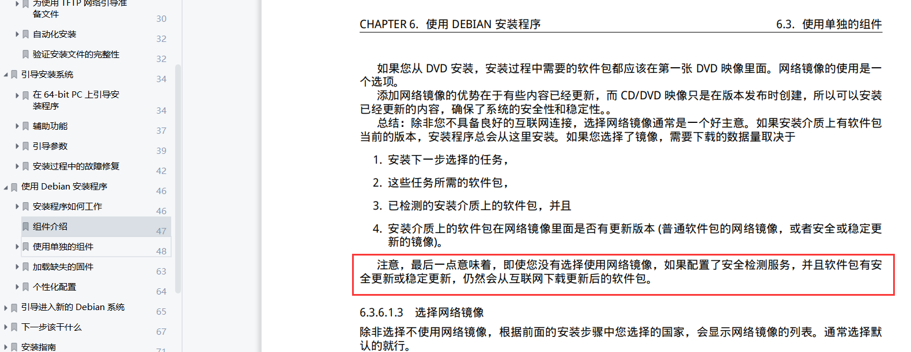

# Debian

官网：<https://www.debian.org>

## 预定信息
1. 虚拟机最低硬件要求：2个核心，1G内存；用图形化界面需要更高配置，否则卡顿
2. 测试账号：root/1q2w3e4r, drintau/1q2w3e4r


## 安装
官方文档：<https://www.debian.org/releases/stable/debian-installer/>

安装程序引导语言选中文，不然安装错了就得重来。这一步会导致安装好后控制台中文乱码，到时再设置一下。
参考：<https://www.cnblogs.com/nihaorz/p/12069699.html>

把启用虚拟机网络关闭，不然后面会去网络上下载新的镜像资源。Debian安装手册第6章安装额外的软件有说明。


如果前面不小心配置了网络，或确实需要用网络，那就配置一下镜像源，下载成功率高一些并快一些。
参考：<https://blog.csdn.net/weixin_44885534/article/details/127758696>

安装完基本系统后，到安装额外的软件，都是看个人需要进行选择安装的了。不过SSH server和标准系统工具选择安装一下，能省去后面很多缺东少西的麻烦。

默认镜像源（安装是断网跳过选择的，不然默认可能是当时选的那个）的速度很差，设置一下国内的，比如清华大学的：<https://mirrors.tuna.tsinghua.edu.cn/help/debian/>

初始只有vi，学习命令 <https://blog.csdn.net/cyl101816/article/details/82026678>

可以安装vim等软件了。`apt-get install vim`

安装ssh（如果一开始跳过了，现在又需要安装的话）`apt-get install ssh`，并设置。<https://www.cnblogs.com/zf29506564/p/5924764.html>、<https://www.cnblogs.com/liu-ke/p/14166097.html>

## 远程连接
有许多远程连接linux的软件工具。  
windows自带的PowerShell也可以。  
```
格式：ssh 用户名@IP地址
示例：ssh root@192.168.56.1
```

## 桌面环境
著名桌面环境：KDE（这个比较炫酷），GNOME，等等（百度搜就有很多）。  
Debian桌面环境介绍<https://wiki.debian.org/zh_CN/DesktopEnvironment>  
参考：
1. <https://linux.cn/article-6441-1.html>
2. Debian文档：<https://wiki.debian.org/zh_CN/FrontPage?action=show&redirect=%E9%A6%96%E9%A1%B5>
3. ArchLinux文档：<https://wiki.archlinux.org/index.php/Desktop_environment_(%E7%AE%80%E4%BD%93%E4%B8%AD%E6%96%87)>
4. ArchLinux各种组件介绍：<https://wiki.archlinux.org/index.php/List_of_applications_(%E7%AE%80%E4%BD%93%E4%B8%AD%E6%96%87)#%E5%85%B6%E5%AE%83_2>

**WindowManager 窗口管理器**：如[OpenBox](https://wiki.debian.org/Openbox)，还有其他看官网介绍。

**X Window System**：安装后运行startx就可以进入openbox了。自行学习安装。

**Display Manager 显示管理器**：如LightDM。安装完就可以直接进入到图形登录界面，不用在命令行运行startx。还有其他看官网介绍。

**Taskbars / panels / docks 任务栏面板**：tint2就有任务栏了。还有其他看官网介绍。

**File Manager 文件管理器**：如PCManFM，这个官网就是LXDE官网里的一部分。

**清理与监控软件**
1. https://linux.cn/article-5864-1-rel.html
2. https://www.howtoing.com/ccleaner-alternatives-for-ubuntu
3. BleachBit这个比较正规，在软件库可以下载到，用了这个。
4. Stacer软件库没有，照着github官网安装很简单，很炫酷。
5. 360 for Linux凉了，第一个试的就是这个，安装不上。

## 自带的终端命令行字小中文乱码
1. <https://blog.csdn.net/bocai_xiaodaidai/article/details/99639058>
2. <https://blog.csdn.net/noctur_kaiser/article/details/105171513>
3. 中文乱码：安装字体，支持中文的就可以。
4. Debian文档：<https://wiki.debian.org/Fonts>，随便选。
5. 选择性安装字体管理器。