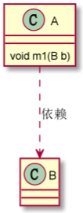
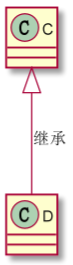
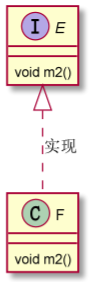
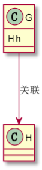
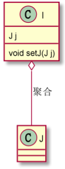
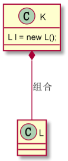

# UML类图

## 类的关系与符号表示

#### 1. 依赖：虚线+箭头

#### 2. 继承：空心三角+实线

#### 3. 实现：空心三角+虚线

#### 4. 关联：实线、实线+单向箭头、实线+双向箭头
关联的双方一般是平级的；而聚合、组合有整体包含部分的含义。如：我有（关联）一个朋友。  

#### 5. 聚合：空心菱形+实线
聚合关系是一种强关联关系，是 has-a 的关系，**整体和部分可以分开**。如：学校有老师。  

#### 6. 组合：实心菱形+实线
组合关系是一种更强烈的聚合关系，是 contains-a 关系，**整体和部分不可以分开**。如：头包含鼻子。  

## IDEA画UML类图插件
1. PlantUML integration：有一个开源工具PlantUML，参考 [文档](https://plantuml.com/zh/class-diagram) 画类图。

## PlantUML类图手册
1. 依赖：A ..> B
2. 继承：C <|-- D
3. 实现：E <|.. F
4. 关联：G --> H
5. 聚合：I o-- J 小写字母o
6. 组合：K *-- L
