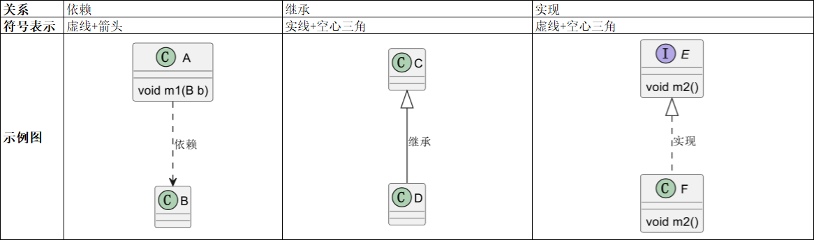
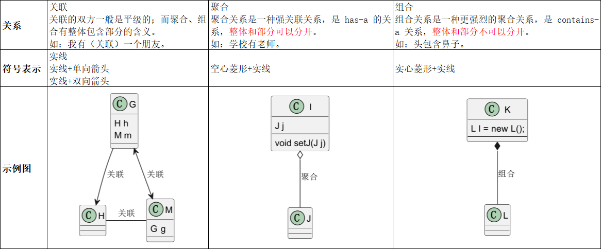

# UML类图

## 类的关系与符号表示



## IDEA画UML类图插件
PlantUML integration：有一个开源工具PlantUML，参考 [文档](https://plantuml.com/zh/class-diagram) 画类图。

## PlantUML类图手册
```txt
依赖：A ..> B
继承：C <|-- D
实现：E <|.. F
关联：G --> H
聚合：I o-- J 小写字母o
组合：K *-- L
```
