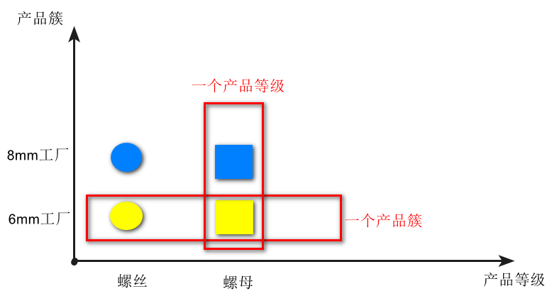
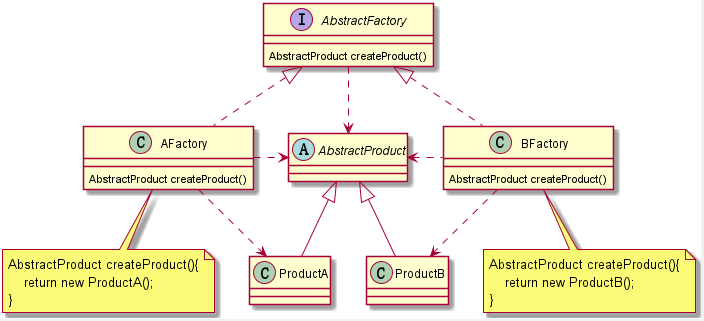

# 设计模式

## 1. 设计模式目的
1. 提升软件的维护性、通用性和扩展性，降低软件的复杂度。核心是七大设计原则。
2. 设计模式有优点也有缺点，每种设计模式都有其适用的场景，不要为了使用设计模式而使用设计模式，切记防止“模式的滥用”。

## 2. 设计模式分类
**公认的是23种（即：GoF设计模式）。**  

|模式的类型|包含的模式|
|--------|:-------|
|创建型模式|单例模式、工厂模式、抽象工厂模式、原型模式、建造者模式|
|结构型模式|适配器模式、装饰器模式、代理模式、外观模式、桥接模式、组合模式、享元模式|
|行为型模式|策略模式、模板方法模式、观察者模式、迭代器模式、责任链模式、命令模式、备忘录模式、状态模式、访问者模式、中介者模式、解释器模式|

## 3. 各种设计模式

### 3.1 单例模式（Singleton Pattern）
##### 定义
系统中只有一个类的唯一实例。
##### 示例
###### 饿汉式（静态常量）
```java
class A{
    private A(){}
    private static final A instance = new A();
    public static A getInstance(){
        return instance;
    }
}
```
###### 饿汉式（静态代码块）
```java
class A{
    private A(){}
    private static A instance;
    static {
        instance = new A();
    }
    public static A getInstance(){
        return instance;
    }
}
```
###### 懒汉式（双重检查，Double-Check）
```java
class A{
    private A(){}
    // volatile 保证内存可见性
    private static volatile A instance;
    public static A getInstance(){
        if (instance == null) {
            synchronized (A.class) {
                if (instance == null) {
                    instance = new A();
                }
            }
        }
        return instance;
    }
}
```
###### 懒汉式（静态内部类）
静态内部类特点（懒加载）：静态内部类B在A类被装载时不会立即初始化；当`getInstance()`被调用时才会装载B，才会实例化。
```java
class A{
    private A(){}
    private static class B {
        private static final A INSTANCE = new A();
    }
    public static A getInstance(){
        return B.INSTANCE;
    }
}
```
###### 枚举
借助JDK1.5的枚举来实现单例模式，不仅避免多线程同步问题，而且还能防止反序列化重新创建对象。
```java
public class Main {
    public static void main(String[] args){
        A a = A.INSTANCE;
        a.method1();
    }
}

enum A{
    INSTANCE;
    public void method1(){}
}
```
##### 总结
1. 饿汉式只是有可能造成内存浪费（从头到尾没有使用该实例），但简单易懂，由JDK保证线程安全；所以使用不会有大问题。
2. 懒汉式需要考虑到懒加载、线程安全、效率问题。
##### 补充：java中创建类的方式
1. new关键字：单例模式解决这点。
2. 反射：会破坏单例模式。
3. 反序列化：会破坏单例模式，添加readResolve()方法解决。
4. 克隆：会破坏单例模式。

### 3.2 工厂模式
##### 定义
定义一个创建产品对象的工厂接口，将产品对象的实际创建工作推迟到具体子工厂类当中。  
##### 概念
+ 产品：类。
+ 抽象产品：抽象类、接口。
+ 产品簇：是指由同一个工厂生产的，位于不同产品等级结构中的一组产品。
+ 产品等级：产品等级结构即产品的继承结构。

#### 3.2.1 简单工厂模式（Simple Factory Pattern，不属于23种设计模式之一）
简单工厂模式是工厂模式的一种，也叫“静态工厂模式”。
##### UML类图

##### 总结
1. 优点：简单易懂。
2. 缺点：工厂类单一，代码臃肿，违背高聚合原则。
3. 缺点：新增一个产品，就要增加一个具体产品类，修改工厂逻辑；增加系统的复杂度，违背“开闭原则”。
4. 结论：对于产品种类相对较少且趋于不变的情况，可以考虑使用。
#### 3.2.2 工厂方法模式（Factory Pattern，这个对应GoF的工厂模式）
##### UML类图

##### 总结
1. 优点：创建新产品只需多写一个相应的产品类、工厂类，无需修改之前的代码；完美符合“开闭原则”。
2. 缺点：产品增多时，类会爆炸式增长；一个抽象工厂只能生产一种产品（抽象工厂模式解决）。
3. 结论：只有一个产品等级且产品种类在一定数量内时，可以考虑使用。
#### 3.2.3 抽象工厂模式（Abstract Factory Pattern）
##### UML类图

##### 总结
1. 优点：把工厂类的数量减少了。无论多少个产品等级，抽象工厂类就一个，工厂类就一套！
2. 抽象工厂中，生产的多个产品之间必须有内在联系，即产品簇。
3. 缺点：产品等级发生变化（增删），需要修改以前的所有工厂代码，违反了“开闭原则”。
4. 结论：当产品等级比较固定时，可以考虑使用抽象工厂模式；如果产品等级经常变化，则不建议使用抽象工厂模式。

### 3.3 原型模式（Prototype Pattern）
##### 定义
用原型实例指定创建对象的种类，并且通过拷贝这些原型创建新的对象。
#### 3.3.1 浅拷贝
##### 示例
1. 实现Cloneable接口。
2. 重写Object的clone方法，修改访问权限修饰符为public。
```java
public class ShallowClone implements Cloneable{
    private String name;
    private Date birthday; // 引用对象

    @Override
    public Object clone() throws CloneNotSupportedException {
        return super.clone();
    }
}
```
##### 总结
1. 优点：简单，能实现基本的拷贝。
2. 缺点：拷贝对象与原对象中的引用对象指向同一个内存地址，任何一个副本修改引用对象中的属性都会影响其他副本。
3. 结论：**不推荐使用**。
#### 3.3.2 深拷贝（重写clone方法）
##### 示例
浅拷贝的基础上，在clone方法中处理引用对象的拷贝。
```java
public class DeepClone implements Cloneable{
    private String name;
    private Date birthday;
    public void setBirthday(Date birthday) {this.birthday = birthday;}
    public Date getBirthday() {return birthday;}
    @Override
    public Object clone() throws CloneNotSupportedException {
        DeepClone cloneObj = (DeepClone)super.clone();
        Date copyDate = (Date)cloneObj.getBirthday().clone();
        cloneObj.setBirthday(copyDate);
        return cloneObj;
    }
}
```
##### 总结
1. 优点：解决了浅拷贝的问题。
2. 缺点：当引用对象有很多层时（即引用对象里面还有引用对象），重写clone方法的工作量非常大！
3. 结论：**不推荐使用**。
#### 3.3.3 深拷贝（序列化）
##### 示例
1. 实现Cloneable接口，Serializable接口。
2. 重写Object的clone方法为：把当前对象写入到内存，然后从内存反序列化对象；修改访问权限修饰符为public。
```java
public class DeepClone implements Cloneable, Serializable {
    @Override
    public Object clone() {
        try {
            // 对象写到内存
            ByteArrayOutputStream bos = new ByteArrayOutputStream();
            ObjectOutputStream oos = new ObjectOutputStream(bos);
            oos.writeObject(this);
            oos.close();

            // 从内存中取数据
            byte[] bytes = bos.toByteArray();

            ByteArrayInputStream bis = new ByteArrayInputStream(bytes);
            ObjectInputStream ois = new ObjectInputStream(bis);
            Object cloneObj = ois.readObject();
            ois.close();
            return cloneObj;
        } catch (Exception e) {
            throw new RuntimeException(e);
        }
    }
}
```
##### 总结
1. 优点：完美的“原型模式”的实现。
2. 结论：**推荐使用**。

### 3.4 建造者模式（Builder Pattern）
##### 定义
将一个复杂对象的构建与它的表示分离，使得同样的构建过程可以创建不同的表示。
##### UML类图

##### 总结
1. 建造者接口用于稳定建造过程，指挥者用于把指挥过程从客户端分离。
2. 指挥者依赖建造者接口，满足“依赖倒置原则”。
3. 工厂模式关注新建产品的结果；建造者模式关注新建产品的过程。

### 3.5 装饰器模式（Decorator Pattern）
##### 定义
在不必改变原类文件和使用继承的情况下，动态地扩展一个对象的功能。
##### UML类图

##### 示例
JDK中，I/O流就是使用了装饰模式，抽象装饰类是FilterXXXXStream。
##### 总结
1. 优点：新增组件类，以及新增装饰器类，都不会违反“开闭原则”。
2. 缺点：过度使用会导致出现许多装饰器类，但已经是最优方案了。

### 3.6 适配器模式（Adapter Pattern）
##### 定义
将一个类的接口适配成用户所期待的接口，让那些接口不兼容的类可以一起工作。  
通俗的解释：根据已有接口，生成想要的接口。
##### UML类图

##### 示例
原本有一个类，发现它与新写的类及其类似，想把它用到新写的功能接口上面去。
##### 总结
1. 关键点：**已有接口生成新的接口**。
2. 体现“开闭原则”、“组合优于继承”。

### 3.7 组合模式（Composite Pattern）
##### 定义
将对象组合成树形结构以表示“部分-整体”的层次结构，使得用户对单个对象和组合对象的使用具有一致性。
##### UML类图

##### 示例
JDK中，swing下的JXXXX各种组件就是使用组合模式。
##### 总结
1. 这个模式使用场景很固定，就是需要用到“树形结构”的地方。
2. 抽象父类具有节点和叶子要暴露的方法，但都是没有具体实现（例如抛异常），让子类去选择性实现。

### 3.8 代理模式（Proxy Pattern）
##### 定义
为另一个对象提供一种代理以控制对这个对象的访问。
##### UML类图

##### 总结
1. 与“装饰者模式”的联系区别，类图相似，意图不同。
2. JDK的动态代理是通过接口实现，所以要求被代理对象必须实现接口。
3. cglib的动态代理是通过子类实现，所以要求被代理对象不能是final修饰的类。

### 3.9 外观模式（Facade Pattern）
##### 定义
也叫“门面模式”；提供一个统一的接口去访问多个子系统的多个不同的接口。
##### UML类图

##### 总结
1. “外观模式”是典型的“迪米特法则”的应用。
2. 优点：调用子系统更容易。
3. 缺点：新增子系统需要修改外观类，违背“开闭原则”。
4. 日常编码都会有意无意的大量使用到“外观模式”，如：写一个Service的方法去调用多个其他Service的方法。
5. 与“中介者模式”有许多相同的地方。

### 3.10 桥接模式（Bridge）
##### 定义
将抽象与实现分离，使它们可以独立变化。
##### UML类图

##### 示例
见代码部分：bridge
##### 总结
1. 优点：增加扩展能力，避免类的爆炸。
2. 缺点：增加复杂度。

### 3.11 享元模式（Flyweight Pattern）
##### 定义
也叫“蝇量模式”；运用共享技术有效的支持大量细粒度的对象。
##### UML类图

##### 示例
1. 各种池技术就是“享元模式”的一种实现：数据库连接池。
2. JDK中使用“享元模式”：String的常量池；用Integer.valueOf()方法创建-128至127之间的Integer对象。
##### 总结
1. 优点：节省内存；对象的集中管理，重复使用。

### 3.12 模板方法模式（Template Pattern）
##### 定义
定义一个算法的步骤，允许子类为一个或多个步骤提供其实践方式。
##### UML类图

##### 总结
1. 缺点：由于继承，如果模板类添加新的抽象方法，则所有子类都要改一遍。

### 3.13 策略模式（Strategy Pattern）
##### 定义
一个类的行为或其算法可以在运行时更改。
##### UML类图

##### 总结
1. 关键点：**运行时替换**。
2. 体现“开闭原则”、“组合优于继承”。

### 3.14 观察者模式（Observer Pattern）
##### 定义
一个对象的行为发生改变会导致一个或者多个其他对象的行为发生改变。
##### UML类图

##### 总结
1. 体现“开闭原则”、“依赖倒置原则”。
2. 缺点：当观察者特别多时，通知观察者是一个比较耗时的操作。
3. MQ（消息队列）具有“观察者模式”的影子。

### 3.15 迭代器模式（Iterator Pattern）
##### 定义
提供一种方法顺序访问一个聚合对象中的各种元素，而又不暴露该对象的内部表示。
##### UML类图

##### 示例
JDK中各种集合的迭代器。
##### 总结
1. 这个模式使用场景很固定，就是用于遍历聚合对象（集合）。
2. 实现方式有多种：可以是内部类实现迭代器，也可以是自身实现迭代器。

### 3.16 状态模式（State Pattern）
##### 定义
允许一个对象在其内部状态改变时改变它的行为，对象看起来似乎修改了它的类。
##### UML类图

##### 总结
1. “状态模式”与“策略模式”是双胞胎。
2. “策略模式”通常由客户端显式指定context（上下文对象）的策略（行为）；“状态模式”将行为封装在状态对象中，context状态的改变会导致行为的改变。

### 3.17 责任链模式（Chain of Responsibility Pattern）
##### 定义
将所有请求的处理者通过前一对象记住其下一个对象的引用而连成一条链；当有请求发生时，可将请求沿着这条链传递，直到有对象处理它为止。
##### UML类图

##### 示例
1. java EE规范中的filterChain。  

2. struts2、springMVC的拦截器。
##### 总结
1. 应当理解其模式，而不是其具体实现；本质是解耦请求与处理，让请求在处理链中能进行传递与被处理。

### 3.18 命令模式（Command Pattern）
##### 定义
将“请求”封装为对象，使发出请求的责任和执行请求的责任分割开。两者之间通过命令对象进行沟通，方便将命令对象进行储存、传递、调用、增加与管理。
##### UML类图

##### 总结
1. 降低耦合度；新增、修改和删除命令符合“开闭原则”。
2. “命令模式”与“组合模式”使用，用来实现“宏命令”功能。
3. “命令模式”与“责任链模式”使用，用来实现一连串的“undo”。
4. “命令模式”与“备忘录模式”使用，用来实现“撤销”功能。

### 3.19 备忘录模式（Memento Pattern）
##### 定义
又叫“快照模式”；在不破坏封装性的前提下，捕获一个对象的内部状态，并在该对象之外保存这个状态，以后需要时能将该对象恢复到原先保存的状态。
##### UML类图

##### 总结
1. 用于场景，如：存盘。
2. 注意：要存储的状态不要和关键对象混在一起。

### 3.20 中介者模式（Mediator Pattern）
##### 定义
也叫“调停者模式”；定义一个中介对象来封装一系列对象之间的交互，使原有对象之间的耦合松散，且可以独立地改变它们之间的交互。
##### UML类图

##### 总结
1. 是“迪米特法则”的典型应用。
2. 优点：降低对象之间的耦合度。
3. 缺点：同事类过多时，中介者类会臃肿、复杂而难以维护。
4. 该模式有一个大名鼎鼎的应用：消息中间件。

### 3.21 访问者模式（Visitor Pattern）
##### 定义
一个作用于某对象结构中各元素的操作，可以在不改变各元素类的前提下定义作用于这些元素的新操作。
##### UML类图

##### 总结
1. 这个模式应用场景比较有限，如：写解析器解析语法树，等等。
2. Java中的ASM框架（Java字节码操纵框架）大量使用此模式。
3. 如果被访问的对象的结构经常改变，则不适合使用“访问者模式”。

### 3.22 解释器模式（Interpreter Pattern）
估计是用不上的了，这个模式用于**编写一套程序**去**解释一门语言**，跟编译原理有很大关系。  
应用场景如：Python语言解释器、Spring表达式语言(SpEL)解释器。